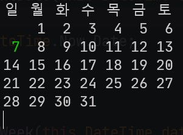

# SimpleCalender
SimpleCalender Cli in .NET



# Dependency
[.NET 6.0](https://dotnet.microsoft.com/download/dotnet/6.0)

# Install

### Step.1
```
$ git clone https://github.com/vin-spiegel/SimpleCalender.git
```

### Step.2
```
$ dotnet pack
```

### Step.3
```
$ dotnet tool install --global --add-source ./SimpleCalender/nupkg ask --version <VERSION_NUMBER>
```

# Usage

```
$ cal
```

# Lisence
MIT
